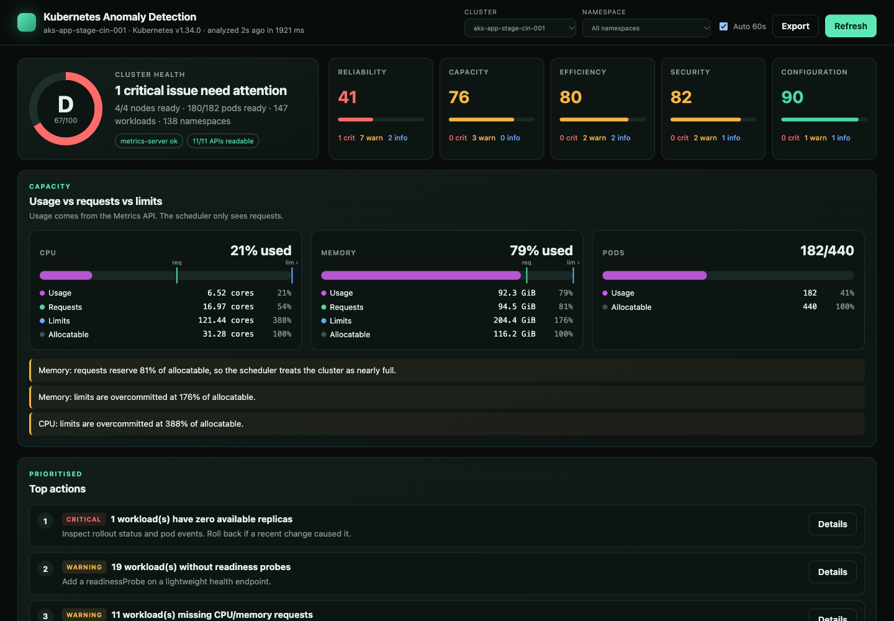

# Kubernetes Anomaly Detection

Source: [github.com/rajamummidi9/Kubernetes-Anomaly-Detection](https://github.com/rajamummidi9/Kubernetes-Anomaly-Detection)

A read-only, single-page health and anomaly report for **any** Kubernetes cluster
(AKS, EKS, GKE, OpenShift, kind, k3s, on-prem). Point it at a kubeconfig context,
or run it in-cluster, and it tells you what is broken, what is about to break, and
what is wasting money, each with a concrete fix.



## What you get

- **Health score (0–100, A–F)** split into reliability, capacity, efficiency, security and configuration.
- **Capacity: usage vs requests vs limits.** Shows what the scheduler sees (requests) next to what is really used, so you can see limit overcommit and idle reservations that tools like Lens hide.
- **Top actions:** the six most valuable fixes, prioritised by severity and blast radius.
- **Insights:** each one has an impact statement, a recommendation, a copy-ready `kubectl` command or YAML snippet, and the affected workloads. Checks include:

| Category | Checks |
|---|---|
| Reliability | NotReady / pressured / cordoned nodes, workloads with 0 or partial replicas, CrashLoopBackOff, image pull errors, config errors, OOMKilled, recent restarts, Pending / evicted pods, replicas on a single node, missing readiness probes, single replicas, missing PDBs, chronic warning events (deduplicated, with age and count) |
| Capacity | Hot nodes (CPU/memory), pod density, request saturation, **N+1 headroom** (can the cluster survive losing its largest node?), requests far below real usage |
| Efficiency | Over-provisioned workloads with reclaimable CPU/memory, near-memory-limit containers, leftover finished pods, HPAs pinned (min = max), maxed or broken |
| Security | Privileged containers, mutable image tags (`:latest`), containers running as root |
| Configuration | Missing requests/limits (with a `LimitRange` fix), kubelet version skew, missing metrics-server, RBAC coverage gaps |

- **Nodes, namespaces, top pods and warning events:** all tables are sortable. Namespaces have their own score, and you can click one to filter the whole page.
- **Export** the report as Markdown (for tickets/PRs) or JSON (for automation).
- **Advisors**, from the same snapshot:
  - **Security** — Pod Security admission, cluster-admin bindings, dangerous capabilities, hostPath, default ServiceAccounts, LoadBalancers, and Ingresses without TLS.
  - **Upgrades** — where the control plane sits in the upstream support window, the patch you are behind, kubelet skew, and what to fix before a node drain. The catalog is dated; the page links to kubernetes.io/releases.
  - **Investigations** — when something is failing, related signals are grouped into a likely cause and the next `kubectl` checks (crash loops, OOM, image pull, pending pods, node pressure, secret sync, load balancer sync, probe restarts).
- **Optional baseline detector:** set `PROMETHEUS_URL` (Prometheus, Cortex, Mimir, Thanos) to add z-score anomalies on CPU, memory, errors and latency.

## Works anywhere

| Where | How it connects |
|---|---|
| Laptop | Your kubeconfig. Every context appears in the **Cluster** dropdown. |
| In-cluster | ServiceAccount with the read-only `ClusterRole` in `k8s/rbac.yaml` |
| Restricted RBAC | Degrades gracefully: unreadable APIs are shown as coverage gaps instead of failing |
| No metrics-server | Request/limit analysis still works; usage-based checks are skipped and flagged |

It never writes to the cluster. The only verbs it needs are `get` and `list` (plus `watch`).

## Quick start

```bash
make install
make dev                      # http://localhost:8080, uses current kubeconfig context
KUBE_CONTEXT=my-cluster make dev
```

Open `http://localhost:8080/?context=my-cluster&ns=__workloads`. The URL keeps the
selected cluster and namespace filter, so links can be shared.

## API

| Method | Path | Description |
|---|---|---|
| GET | `/` | Dashboard |
| GET | `/health` | Liveness |
| GET | `/v1/contexts` | Available clusters |
| GET | `/v1/analysis?context=&force=` | Full cluster report (JSON) |
| GET | `/v1/report.md?context=` | Markdown report |
| GET | `/v1/dashboard?context=` | Report + baseline status |
| GET | `/v1/intelligence?context=` | Forecasts + cached AI result; no model call |
| POST | `/v1/intelligence?context=&force=&notify=` | Generate RCA; optionally send configured alerts |
| POST | `/v1/evaluate` | Run a baseline detection cycle |
| GET | `/v1/anomalies`, `/v1/incidents`, `/v1/incidents/{id}` | Baseline results |
| GET | `/docs` | OpenAPI UI |

CI gate example:

```bash
score=$(curl -s "localhost:8080/v1/analysis?context=prod" | jq .scores.overall)
[ "$score" -ge 70 ] || exit 1
```

## Configuration

See `.env.example`. The main settings:

| Variable | Default | Purpose |
|---|---|---|
| `KUBE_CONTEXT` | current context | Default cluster in the UI |
| `WATCH_NAMESPACES` | all | Comma-separated namespace scope |
| `SYSTEM_NAMESPACES` | kube-system, … | Excluded from hygiene checks |
| `EVENT_WINDOW_HOURS` | 6 | Window for restarts / recent events |
| `NODE_WARN_PERCENT` / `NODE_CRITICAL_PERCENT` | 80 / 90 | Node utilisation thresholds |
| `CACHE_TTL_SECONDS` | 30 | Snapshot cache per cluster |
| `PROMETHEUS_URL` / `MIMIR_URL` | empty | Enables the baseline detector |

## Optional AI intelligence

Rules and forecasts detect the problem. The AI layer only explains the supplied
evidence, drafts a prioritized RCA, and formats an alert. It has no Kubernetes
client, tools, shell, kubeconfig, or mutation endpoint.

Supported providers:

| `AI_PROVIDER` | Required settings |
|---|---|
| `openai_compatible` | `AI_MODEL`, `AI_API_KEY`; optional `AI_BASE_URL` for compatible gateways |
| `azure_openai` | deployment name in `AI_MODEL`, resource endpoint in `AI_BASE_URL`, `AI_API_KEY` |
| `anthropic` | `AI_MODEL`, `AI_API_KEY` |
| `gemini` | `AI_MODEL`, `AI_API_KEY` |
| `ollama` | `AI_MODEL`; optional `AI_BASE_URL` (defaults to `http://localhost:11434`) |

Example using an OpenAI-compatible endpoint:

```bash
export AI_PROVIDER=openai_compatible
export AI_MODEL=<model-available-to-your-account>
export AI_API_KEY=<secret>
make dev
```

Normal dashboard refreshes do not call the model. Select **Generate
investigation**, or call:

```bash
curl -X POST 'http://localhost:8080/v1/intelligence?force=true'
```

`GET /v1/intelligence` returns deterministic early warnings and the last AI
result without spending tokens. Capacity risks are immediate. Trend warnings
need three or more forced observations and use a transparent linear slope, not
an LLM guess.

For periodic analysis and alerting, set `INTELLIGENCE_AUTO_RUN=true`, plus one
or more of `ALERT_WEBHOOK_URL`, `SLACK_WEBHOOK_URL`, or `TEAMS_WEBHOOK_URL`.
Alerts are severity-filtered and deduplicated for `AI_CACHE_TTL_SECONDS`.

The evidence pipeline:

1. Selects scores, findings, warning events, deterministic investigations, and forecasts.
2. Redacts secret-like fields, bearer tokens, JWTs, and private keys.
3. Caps the payload at `AI_MAX_INPUT_CHARS`.
4. Treats every Kubernetes string as untrusted data and requires structured JSON.
5. Validates the response with Pydantic before showing or alerting it.

AI output is a hypothesis, not proof. Each root cause includes evidence and
checks that can disprove it. Confirm those checks before applying a change.

## Install on any cluster

The Helm chart is the supported package. It installs a read-only ServiceAccount
in whatever namespace you choose and analyzes the cluster it runs in.

```bash
git clone https://github.com/rajamummidi9/Kubernetes-Anomaly-Detection.git
cd Kubernetes-Anomaly-Detection
helm install anomaly charts/k8s-anomaly-detection \
  --namespace anomaly-detection --create-namespace
kubectl -n anomaly-detection port-forward svc/anomaly-k8s-anomaly-detection 8080:8080
```

The chart defaults to `ghcr.io/rajamummidi9/kubernetes-anomaly-detection`.
Until that image is published, build it locally and set `image.repository`
to the tag you pushed. Chart options are in
`charts/k8s-anomaly-detection/README.md`.

`k8s/` is the same workload as plain manifests (`make k8s-apply`) for clusters
where you do not want Helm.

Leave the Service as ClusterIP. The page lists workloads, events, and security
gaps, so put an authenticating proxy in front of any Ingress. See `SECURITY.md`.

The Deployment runs as non-root with a read-only root filesystem, dropped
capabilities and `RuntimeDefault` seccomp.

## Layout

```
src/anomaly_detection/
  k8s/         client factory (kubeconfig / in-cluster) and parallel paged snapshot
  insights/    index (per-node / per-workload aggregation), rules, scoring, report
  detectors/   optional baseline z-score detector
  static/      single-page dashboard (no build step)
config/        detector weights and PromQL queries
k8s/           Deployment, Service, RBAC
tests/         rules tested against synthetic clusters
```

## Adding a rule

Rules are plain functions in `insights/rules.py` that take the `ClusterIndex` and
thresholds and return `Insight` objects. Append yours to `RULES`. Exceptions are
isolated and reported in `meta.rule_errors`, so one bad rule never breaks the report.

## License

MIT
